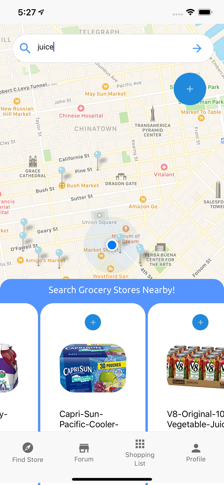

# WeBuy-Frontend
Description: A monitor and shopping assistant for people to buy necessities.

This is the front-end git repository. For the fully functioning app, please 
download the Backend repo at the same time.

## Installation and Configuration
1. Clone the repository.
2. Install node.js from the [official website](https://nodejs.org/en/).
3. Download npm JavaScript Package Manager using [this instruction](https://www.npmjs.com/get-npm).
4. Install [Expo Cli](https://docs.expo.io/workflow/expo-cli/) using npm.
5. Run ```package.json``` before start the project.

Usage
---
Simply type ```expo start``` on your terminal under the project's directory.
Then press the ```open on iOS simulator ``` button. It will then pop up your 
iOS simulator, installing expo client and run the project.

If you want to open the project on your own mobile phone, download Expo Client on
your phone. Then scan the QR code on your browser.

##Demos

Login/register Page


Main Page (Map/Search/... etc.):





Shopping List Page:


Profile Page:


